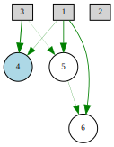

# Neat Implementation In Python

## Source

I'm following [**Efficient Evolution of Neural Networks
through Complexification**](http://nn.cs.utexas.edu/downloads/papers/stanley.phd04.pdf) Paper for the implementation.

---

### Example Crossover Implementation:

Parent 1             |  Parent 2
:-------------------------:|:-------------------------:
  |  

**Child**

> :exclamation: This is assuming both parent genomes are equally fit.

> :warning: This is a work in progress.